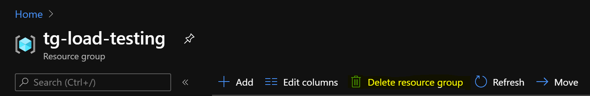

# Load/Performance Testing Setup

Run distributed [Locust](https://locust.io/) load tests on _Azure Container Instances_. It's quick, cheap and scalable! Using 20 workers (previously known as slaves) you can achive ~12 000 req/s!


You can deploy and manage resources using either: 
* [Azure Portal](https://portal.azure.com) - easier
* [Azure Cli](https://docs.microsoft.com/en-us/cli/azure/install-azure-cli?view=azure-cli-latest) - faster 

## Option 1: Azure Portal

Make sure you are logged in to [Azure Portal](https://portal.azure.com).

### 1. Deployment (Portal)

Click magick button (you can open it in new tab):

[](https://portal.azure.com/#create/Microsoft.Template/uri/https%3A%2F%2Fraw.githubusercontent.com%2FORBA%2Fazure-locust%2Fmaster%2Fazuredeploy.json)

Click on **Edit template** and replace the current template with [azuredeploy.json](azuredeploy.json) content.


Then fill form with given values.

- **Subscription:** choose your subscription
- **Resource Group:** select existing Resource Group or create new one
- **Region:** East US (any allowed, but keep in mind its part of Locust DNS address!)
- **Instances (optional):**  number of workers (one worker ~600rps)
- **Prefix (optional):** predefined name, if empty random `xxxxxxxxxxxxx` will be generated


Click **Review + create** and wait for deployment to end. Follow notifications on Azure Portal:


Click **Go to resource group** to verify your deployment:


Go to `xxxxxxxxxxxxx-master` and find out Locust FQDN - copy it.


### 2. Go to dashboard (Portal)

When deployment succeeded, your load generator is ready. Go to the above FQDN and port 8089: 

`http://xxxxxxxxxxxxx-master.eastus.azurecontainer.io:8089` 

At this point you can start tests. 


### 3. Updating script (Portal)

Go to your Resource Group and click **Storage Account** named `xxxxxxxxxxxxx`. 


Click _File shares_ (scroll down to find it).
Go to share called `scripts` and edit `locustfile.py` (click `...` to edit).
Edit contents of your locust file to be the one in the [repo](locustfile.py) and click _Save_.


Then restart all containers called *master* and *worker*.


Click on each container to restart it:


**Tip:** This step is really faster using Azure CLI.

### 4. Cleanup (Portal)

Go to your Resource Group and remove it (it will destroy all resources inside group). 
You will need to type Resource Group name to confirm.



## Option 2: Azure CLI

Login and set subscription context

```
az login
az account set --subscription <SubscriptionId>
```

### 1. Deployment (CLI)

**Step 1:** Setup your names
```
export RG=<ResourceGroup>
```

**Step 2:** Create Resource Group (if not exists)
```
az group create --name ${RG} --location northeurope
```

**Step 3:** Deploy ARM template
```
az group deployment create --resource-group ${RG} --query properties.outputs --template-file azuredeploy.json 
```
- To change number of instances append `--parameters instances=<n>`
- If you want use predefined prefix append `--parameters prefix=<customPrefix>`

**Step 4:** Note values of `prefix` and `url` from console output.

```json
{
  "outputs": {
    "prefix": {
      "type": "String",
      "value": "xxxxxxxxxxxxx"
    },
    "url": {
      "type": "String",
      "value": "http://xxxxxxxxxxxxx-master.northeurope.azurecontainer.io:8089"
    }
  }
}
```

### 2. Go to dashboard (CLI)

When deployment succeeded, your load generator is ready. Go to above `url` address. 

At this point you can start tests. 

### 3. Update script (CLI)

Upload your custom script. Replace account name with above `prefix`. You can change `--source` param if you want use different .py file:
```
az storage file upload --account-name <prefix> -s scripts --source locustfile.py --path locustfile.py
```
Then restart containers:
```
az container list --resource-group ${RG} --query '[].name' -o tsv | xargs -I {} az container restart --no-wait --resource-group ${RG} --name {} 
```

### 4. Cleanup (CLI)

Remove resources from Azure:
```
az group delete --name ${RG} --yes
```

## Disclaimer

* Load test affects target service performance. Never run load tests without service owner permission!
* Some services can block traffic from generator - you should whitelist Azure Region IPs ([Download prefixes](https://www.microsoft.com/download/details.aspx?id=56519)).
* After load tests cleanup Azure resources. You will be billed for running Azure Contianers Instance and Storage Account usage. You can check cost of ACI [here](https://azure.microsoft.com/en-us/pricing/details/container-instances/).